# FCOM India Website Directory Structure

Based on scraping https://fcomindia.com/, here is the complete page hierarchy and URL structure.

**Platform:** WordPress (WooCommerce)

---

## 1. Home
- `/` — Homepage with hero slider, how it works, bestsellers, testimonials, trust badges

---

## 2. Company / Static Pages
- `/about-fcom/` — About Us (founder story, journey timeline)
- `/contact-us/` — Contact Us (walk-in address, phone, email, working hours, map)
- `/faq/` — Frequently Asked Questions (accordion-style Q&A)
- `/terms/` — Terms and Conditions
- `/refund_returns-2/` — Refund and Returns Policy

---

## 3. Tailoring (Main Service Hub)
Landing pages for each customer segment with 4 service category cards:
- **Consultation & Stitching**
- **Refit & Repair** (Alterations)
- **Restyle & Repurpose**
- **Dye, Darn & Embroidery**

### 3.1 Women Tailoring
- `/women-tailoring/` — Landing page
- `/custom-stitching-women/` — Custom Stitching product listing
- `/alteration-women/` — Alteration product listing
- `/restyling-women/` — Restyling product listing
- `/others-women/` — Other services product listing

#### Women Custom Stitching Products
- `/product/lehenga-design-stitching/` — Lehenga Custom Design & Stitching
- `/product/kurti-design-stitching/` — Kurti Custom Design and Stitching
- `/product/anarkali-design-stitching/` — Custom Anarkali Design & Stitching
- `/product/saree-blouse-design-stitching/` — Saree Blouse Design & Stitching
- `/product/jumpsuit-design-stitching/` — Women's Jumpsuit Design & Stitching
- `/product/bottom-wear-women/` — Bottom Wear Design & Stitching
- `/product/ready-to-wear-sarees/` — Ready To Wear Pre-Stitched Saree
- `/product/saree-petticoat-fall-pico/` — Saree Petticoat Fall & Pico
- `/product/dress-gown-design-stitching-women/` — Dress & Gown Design & Stitching
- `/product/coat-jacket-design-stitching-women/` — Coats & Jackets Design & Stitching
- `/product/top-shirt-design-stitching/` — Women's Top/Shirt Design & Stitching
- `/product/seasonal-wear-stitching-women/` — Indian Seasonal Wear Design & Stitching

#### Women Alteration Products
- `/product/waist-sides-adjustment/` — Waist & Sides Adjustment
- `/product/sleeve-adjustment-women/` — Sleeve Adjustment
- `/product/shoulder-armhole-adjustment-women/` — Shoulder & Armhole Adjustment
- `/product/repairs-women/` — Clothes Repairing
- `/product/overall-refitting-women/` — Garment Refitting
- `/product/length-adjustment-women/` — Length Adjustment

### 3.2 Men Tailoring
- `/men-tailoring/` — Landing page
- `/coming-soon/` — Custom Stitching (placeholder)
- `/alteration-men/` — Alteration product listing
- `/restyling-men/` — Restyling product listing
- `/others-men/` — Other services product listing

#### Men Alteration Products
- `/product/length-adjustment-men/` — Length Adjustment for Men's Clothes
- `/product/overall-refitting-men/` — Men's Clothes Refitting Services

#### Men Restyling Products
- `/product/repurpose-jeans-men/` — Men's Jeans Repurposing

### 3.3 Kids Tailoring
- `/coming-soon/` — Placeholder page

### 3.4 Home Textiles
- `/coming-soon/` — Placeholder page

### 3.5 Pets
- `/coming-soon/` — Placeholder page

---

## 4. Products (Physical Goods)
- `/products/` — Main products landing page
- `/laces-borders/` — Laces/Borders product listing

### 4.1 Laces Products
- `/product/lace-5/` — Lace (₹801)
- `/product/lace-2/` — Lace (₹891)
- `/product/lace-3/` — Lace (₹891)
- `/product/lace-4/` — Lace (₹891)

### 4.2 Product Categories
- `/product-category/custom-stitching-women/` — Custom Stitching Services Women
- `/product-category/alteration-men/` — Clothes Alteration Men
- `/product-category/alteration-women/` — Clothes Alteration Women
- `/product-category/laces/` — Laces
- `/product-category/repurpose-restyling-men/` — Repurpose & Restyling Men

### 4.3 Product Tags
- `/product-tag/bestselling/` — BestSelling

---

## 5. Blog
- `/blogs/` — Blog listing page (paginated)

### 5.1 Blog Categories
- `/category/custom-stitching/` — Custom Stitching (7 posts)
- `/category/fashion-tips/` — Fashion Tips (14 posts)
- `/category/fcom-updates/` — FCOM Updates (2 posts)
- `/category/alteration/` — Garment Alteration (4 posts)
- `/category/repurposing/` — Garment Repurposing (6 posts)
- `/category/restyling/` — Garment Restyling (9 posts)
- `/category/ethnic-wear/` — Indian Ethnic Wear (11 posts)
- `/category/online-tailoring/` — Online Tailoring (12 posts)

### 5.2 Sample Blog Posts
- `/sleeve-restyling-services-upgrade-look-fcom-india/` — Men's Sleeve Restyling
- `/repurpose-sarees-navratri-durga-puja-fcom-india/` — Saree Repurposing
- `/ready-to-wear-saree-stitching-effortless-elegance-for-every-occasion/` — Ready-to-Wear Saree
- `/expert-mens-clothing-repairs-alterations-fcom-india/` — Men's Clothing Repairs
- `/shirts-pants-adjustments-men-fcom-india/` — Shirts & Pants Adjustments

### 5.3 Date Archives
- `/2025/02/` — February 2025 archive

---

## 6. Gallery
- `/gallery/` — Photo gallery page (image grid/masonry)

---

## 7. Account & Order Management
- `/my-account-3/` — Track Your Order / My Account
- `/cart/` — Shopping Cart

---

## 8. Common UI Components (Shared Across All Pages)

### Header
- Skip to content link
- Top navigation bar (3 instances: desktop header, mobile header, sticky/mobile menu)
- Logo linking to home
- Cart icon with item count
- Hamburger menu toggle

### Navigation Menu
- **Home** (dropdown: About Us, Contact Us, FAQ)
- **Tailoring** (dropdown: Women, Men, Kids, Pets)
- **Products** (dropdown: Laces/Borders)
- **Blogs**
- **Gallery**
- **Track Your Order**

### Footer (Global)
- **Company Info:** Address, company name (Rhapso Fashion Tech India Pvt Ltd)
- **Useful Links:** Refunds and Returns, Terms and Conditions
- **Main Menu:** Full site navigation repeat
- **Contact:** Phone (+91 9108902222), Email (customercare@fcomindia.com)
- **Social:** Facebook, Instagram
- **Get A Callback** button / modal
- **WhatsApp Us** floating button

### Modals / Overlays
- Mobile navigation drawer
- Cart sidebar/drawer
- Callback request modal
- Quick view product modal

---

## 9. URL Patterns / WordPress Structure

| Pattern | Purpose |
|---------|---------|
| `/*/` | Static pages (WordPress pages) |
| `/product/*/` | Individual WooCommerce products |
| `/product-category/*/` | WooCommerce product category archives |
| `/product-tag/*/` | WooCommerce product tag archives |
| `/category/*/` | WordPress blog category archives |
| `/2025/02/` | WordPress date archives |
| `/?page_id=2589` | WordPress page ID reference |
| `/?add-to-cart=ID` | Add to cart action URLs |
| `/?quick_view_button=ID` | Quick view action URLs |

---

## 10. Key Observations

1. **CMS:** WordPress with WooCommerce for products/cart
2. **Theme:** Custom or heavily customized (Qode Interactive / Esmee base detected in some links)
3. **Services modeled as products:** Each tailoring service is a WooCommerce product with variable options
4. **Heavy use of "coming-soon" pages:** Kids, Home, Pets, and some Men services are not yet live
5. **Service delivery modes:** Home Visit, Store Visit, Send Through Other Services
6. **Pricing:** Starts from ₹99 (alterations) to ₹1,599+ (custom stitching)
7. **Geographic focus:** Bangalore (Indiranagar), with expansion plans to Mumbai, Delhi, Kolkata, Pune

---

## 11. Site Tree (Mermaid)

```mermaid
graph TD
    Root["/ (Home)"] --> Company["2. Company / Static"]
    Root --> Tailoring["3. Tailoring"]
    Root --> Products["4. Products (Physical)"]
    Root --> Blog["5. Blog"]
    Root --> Gallery["6. Gallery"]
    Root --> Account["7. Account & Cart"]

    Company --> About[/about-fcom/]
    Company --> Contact[/contact-us/]
    Company --> FAQ[/faq/]
    Company --> Terms[/terms/]
    Company --> Refunds[/refund_returns-2/]

    Tailoring --> Women[/women-tailoring/]
    Tailoring --> Men[/men-tailoring/]
    Tailoring --> Kids[/coming-soon/]
    Tailoring --> HomeTextiles[/coming-soon/]
    Tailoring --> Pets[/coming-soon/]

    Women --> W_Stitching[/custom-stitching-women/]
    Women --> W_Alteration[/alteration-women/]
    Women --> W_Restyle[/restyling-women/]
    Women --> W_Others[/others-women/]

    W_Stitching --> P1[/product/saree-blouse-design-stitching/]
    W_Stitching --> P2[/product/lehenga-design-stitching/]
    W_Stitching --> P3[/product/kurti-design-stitching/]
    W_Stitching --> P4[/product/anarkali-design-stitching/]
    W_Stitching --> P5[/product/ready-to-wear-sarees/]
    W_Stitching --> P6[/product/top-shirt-design-stitching/]
    W_Stitching --> P7[/product/dress-gown-design-stitching-women/]
    W_Stitching --> P8[/product/coat-jacket-design-stitching-women/]
    W_Stitching --> P9[/product/seasonal-wear-stitching-women/]
    W_Stitching --> P10[/product/jumpsuit-design-stitching/]
    W_Stitching --> P11[/product/bottom-wear-women/]
    W_Stitching --> P12[/product/saree-petticoat-fall-pico/]

    W_Alteration --> A1[/product/waist-sides-adjustment/]
    W_Alteration --> A2[/product/sleeve-adjustment-women/]
    W_Alteration --> A3[/product/shoulder-armhole-adjustment-women/]
    W_Alteration --> A4[/product/repairs-women/]
    W_Alteration --> A5[/product/overall-refitting-women/]
    W_Alteration --> A6[/product/length-adjustment-women/]

    Men --> M_Alteration[/alteration-men/]
    Men --> M_Restyle[/restyling-men/]
    Men --> M_Others[/others-men/]

    M_Alteration --> MA1[/product/length-adjustment-men/]
    M_Alteration --> MA2[/product/overall-refitting-men/]
    M_Restyle --> MR1[/product/repurpose-jeans-men/]

    Products --> Laces[/laces-borders/]
    Laces --> L1[/product/lace-2/]
    Laces --> L2[/product/lace-3/]
    Laces --> L3[/product/lace-4/]
    Laces --> L4[/product/lace-5/]

    Blog --> Blogs[/blogs/]
    Blogs --> Cat1[/category/fashion-tips/]
    Blogs --> Cat2[/category/online-tailoring/]
    Blogs --> Cat3[/category/ethnic-wear/]
    Blogs --> Cat4[/category/restyling/]
    Blogs --> Cat5[/category/repurposing/]
    Blogs --> Cat6[/category/custom-stitching/]
    Blogs --> Cat7[/category/alteration/]
    Blogs --> Cat8[/category/fcom-updates/]
    Blogs --> Archive[/2025/02/]

    Account --> MyAccount[/my-account-3/]
    Account --> Cart[/cart/]
```

